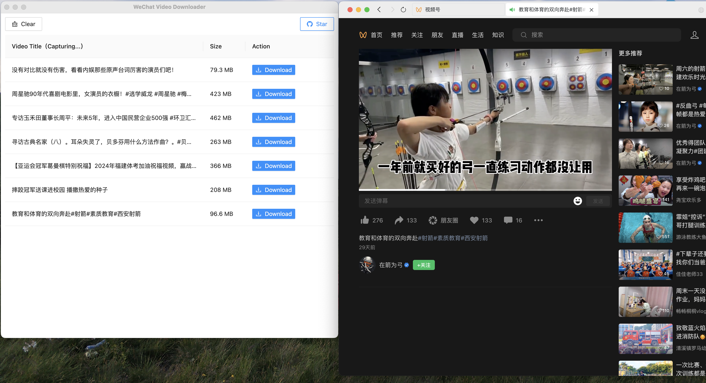

[](https://ko-fi.com/E1E8TLH0X)
# WeChat Video Downloader (English fork of [Chinese product](https://github.com/lecepin/WeChatVideoDownloader))

NOTE: I am not author use on your own risk.

- Catching video automatically without any additional actions
- Available for Win/Mac




## Note

Internally, a proxy is used to intercept request identification, so this software needs 
to install a certificate and automatically open the proxy (of course, these are automatically executed and no manual operation is required).
When closing this software, the proxy information will be automatically cleared and will not affect use.

## Pre-installation requirements

You should have installed [NodeJS](https://en.wikipedia.org/wiki/Node.js) and [npm](npmjs.com) on your machine

To see if you already have Node.js and npm installed and check the installed version, run the following commands:

```
node -v
npm -v
```


## Installation (Mac/Linux)

Use your console. Open script directory in console.

Run
`npm install`

After installation run
```
npm start
```

Program will open. Follow the instruction on your screen.

Program will ask you to install certificate on your machine via command that will be generated for you. 

After that press recheck button and use. 


